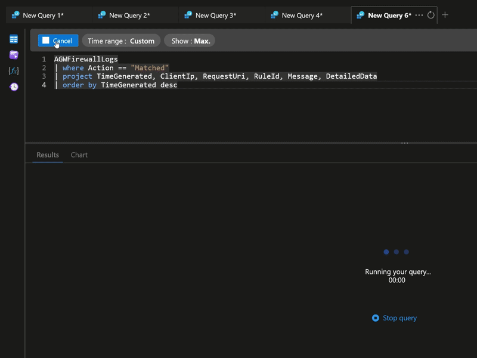
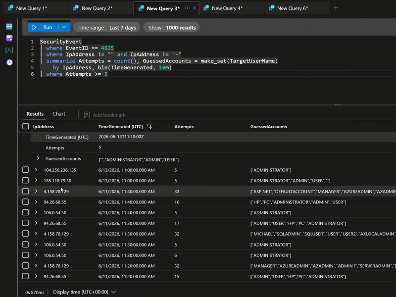
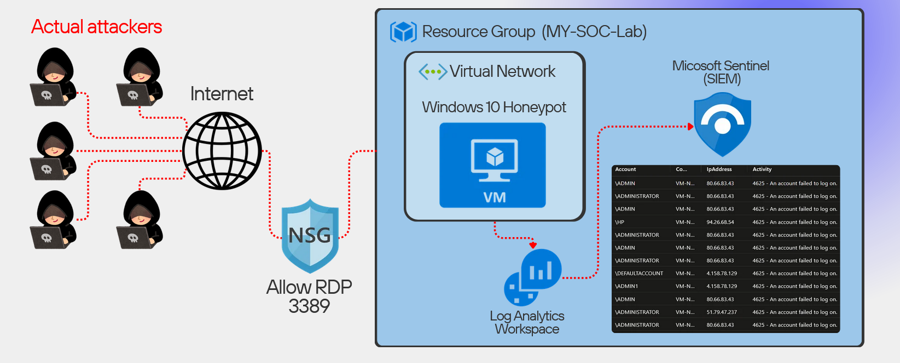
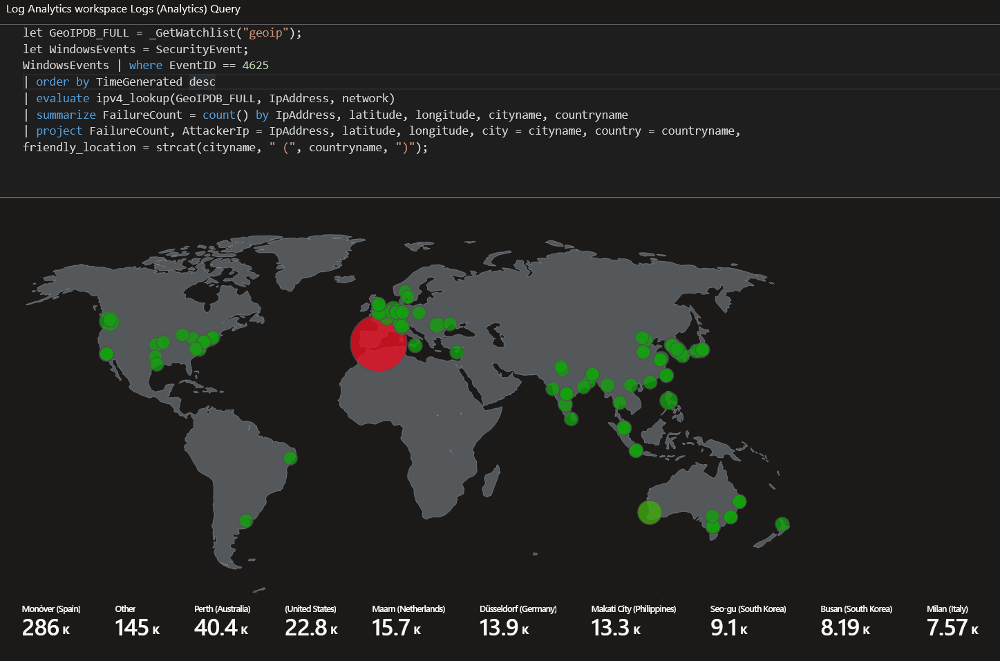

# 🛡️ Azure Cloud SOC — Purple Team Lab

> A cloud-native Security Operations Center on Microsoft Azure that detects **real internet attacks** and defends a web app with a WAF — built to demonstrate the full **detect-and-respond loop** where red team and blue team become one system.

---

## 🎥 Demos

### WAF blocks a SQL injection in real time
A live `' OR 1=1 --` against the login form is stopped with **403 Forbidden** before it reaches the app.

### Real-world attacks caught by the WAF
Querying `AGWFirewallLogs` shows live internet attackers blocked by the OWASP Core Rule Set — path traversal, PHP injection, and SQL injection, all matched and blocked.

### Brute-force detection firing in Microsoft Sentinel
A scheduled analytics rule detects RDP brute-force: external IPs spraying admin usernames (one source tried 12+ per 10-minute window).

---

## 🧭 Architecture

**Blue Team surface — the honeypot pipeline:** internet attackers hit an exposed Windows VM (RDP :3389 via NSG); its security events flow through the Log Analytics workspace into Microsoft Sentinel.

**Red Team surface — the web app:** attacks routed through Burp to an Application Gateway WAF protecting OWASP Juice Shop; malicious payloads are blocked with **403 Forbidden** before reaching the app.

Both surfaces stream into the **same** Log Analytics workspace and Microsoft Sentinel — one unified SOC.

---

### 🌍 GeoIP Attack Map

Attacker IPs from failed-logon events, enriched via a GeoIP watchlist (`ipv4_lookup`) and plotted on a world map — visual proof of constant, worldwide automated attacks against the honeypot.

*Counts are total failed-logon attempts per location (not unique attackers); locations reflect IP hosting, not necessarily the attacker's true origin.*

---

## 🔵 Blue Team — Detection & Response
- Deployed a Windows 10 honeypot with RDP exposed to the internet
- Connected it to Microsoft Sentinel via the Azure Monitor Agent (AMA) + a Data Collection Rule
- Caught **real RDP brute-force attacks** within the first hour (EventID 4625)
- Validated attacker IPs in VirusTotal and built a **GeoIP attack map** of global traffic
- Engineered tuned, **MITRE ATT&CK-mapped** analytics rules that auto-generated incidents
- Worked the incident queue as an analyst (triage → investigate → classify → close)

## 🔴 Red Team — Offensive Testing & WAF Defense
- Deployed OWASP Juice Shop as an Azure Container Instance
- **SQL injection** authentication bypass (`' OR 1=1 --`) → logged in as admin
- **Cross-Site Scripting (XSS)** via the search field
- Placed an Azure Application Gateway **WAF (OWASP CRS)** in front, in Prevention mode
- Re-ran the attacks → blocked with **403 Forbidden**
- Routed WAF logs into the same SOC and hunted attacks in `AGWFirewallLogs`

---

## 🔍 Detection Rules (KQL)
See the [`kql/`](kql/) folder:
| Rule | Detects | MITRE |
|------|---------|-------|
| RDP brute-force | Failed logons (4625) grouped by source IP | T1110.001 |
| Successful logon | Real network/RDP logon (tuned to exclude noise) | T1078 |
| GeoIP attack map | Enriches attacker IPs with location | — |
| WAF attack hunt | Matched attacks in `AGWFirewallLogs` | — |

---

## 💡 Key Lessons
- **Detection is about tuning, not volume** — a naive `contains "success"` rule drowns you in false positives; filtering on EventID, LogonType, and source IP makes alerts meaningful.
- **Context matters** — distinguishing real attacker IPs from Azure platform traffic, and a real breach from an expected admin login, is the core of triage.
- **Offense and defense are one system** — every attack generated telemetry the SOC detected, closing the red/blue loop.

---

## 📄 Full Write-up
[📑 Presentation (PDF)](presentation/Azure_SOC_Project.pdf)

---

**Abdulrahman Alzahrani** — Penetration Tester | Cybersecurity Analyst
🔗 [LinkedIn](https://linkedin.com/in/d7meealz) · ✍️ [Medium](https://medium.com/@d7meealz)
